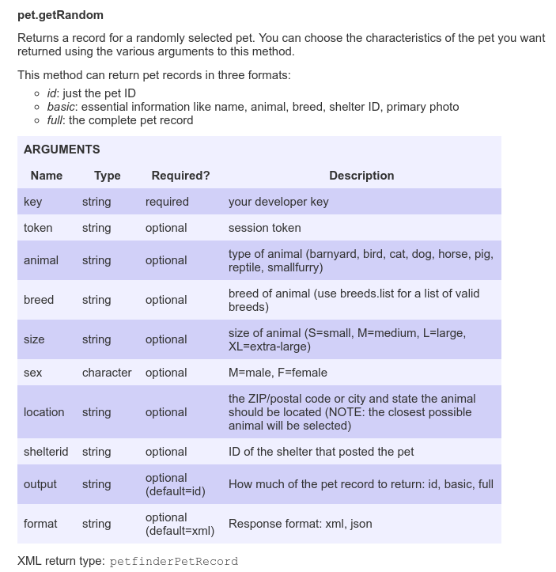

# Welcome
[Petfinder.com](www.petfinder.com) is an online database of adoptable pets. They work with over 14,000 shelters, and have helped the adoption of over 25 million animals. Petfinder offers an API to developers that want to connect to their database.

In this tutorial we’ll make use of the Petfinder API with HTML, Javascript, AJAX, and JSONP.  It’ll help if you have some knowledge of Javascript. 

### Here’s what we’ll cover:
* What’s an API?
* Getting a Key
* Our HTML
* Our Script
* JSONP
* Navigating the Response

### Final product
We will build a form that takes a zip code, calls the Petfinder API, and returns the name, image, and link to the adoption page of a nearby adoptable cat.

### References
[Petfinder API documentation](https://www.petfinder.com/developers/api-docs)
[JSONP/JQuery](https://learn.jquery.com/ajax/working-with-jsonp/)
[JSONP](https://jvaneyck.wordpress.com/2014/01/07/cross-domain-requests-in-javascript/)
[JQuery(1)](https://developers.google.com/speed/libraries/#jquery)
[JQuery(2)](https://www.w3schools.com/jquery/jquery_intro.asp)
[SOP](https://www.w3.org/Security/wiki/Same_Origin_Policy)
[CORS](https://spring.io/understanding/CORS)

# What’s an API?

Let's say you have a cat. If you have a cat, you probably also have a blog about that cat. One day it occurs to you that all the people looking at pictures of your cat might like to have their own. You want to put a search bar in your blog where people can search for adoptable pets near them. Unfortunately, you don’t have the time or resources to build a database of all the adoptable pets in the world. Luckily for you- there are enough cat blogs on the internet that this is a solved problem, and that’s where APIs come in.

**API** stands for **Application Programming Interface**. APIs are provided by the developers of a piece of software. Using the API, other developers can query and receive data from that software, and integrate it into their own, separate software. Petfinder.com offers an API with built in methods that can find and return pet and shelter information from their database.
You can read about Petfinder’s API [here](https://www.petfinder.com/developers/api-docs). Their documentation is very straightforward and thorough, so this tutorial won’t spend too much time restating it. Instead I’ll talk briefly about getting set up with a developer key, and then go into detail on a specific method. If you’re interested in learning more about the required arguments and response formats for every method, it's listed in the documetnation.  

# Getting a Key
When you send any query through the Petfinder API, they require one of your arguments to be a key.  I’ll explain exactly what this means later, but know that it is not unusual - most APIs ask for something called a developer key or API key. It’s a piece of information that identifies who you are and let’s them know you’ve asked for permission to use the API ahead of time. Think of it like a secret password to get into a club (except everyone at the club has their own unique password.) 

Getting a key from Petfinder is easy. The first thing you need to do is sign up for an account.  Go to the [home page](www.petfinder.com) and click ‘Sign In’ at the top right. Then, click the ‘Register Now’ button and fill in your information.

Once you’ve registered navigate to the developer information page, either by clicking [here](https://www.petfinder.com/developers/api-key), or scrolling to the bottom of the page and clicking ‘For Developers’. 

This will bring you right to the key request page, pictured below. Select the Reason for use from the dropdown, check the terms and service button, and hit the ‘Request a Key’ button. 

You’re done! Your API Key will be automatically generated, and you’ll be redirected to that page. You also get something called an API Secret. You would need this if you were going to use the API to request private information, like user data. Our tutorial is only using public data so I won’t go into it, but you can read more about it in the [documentation](https://www.petfinder.com/developers/api-docs) if you’re interested. 

Now that you have your key, you’re almost ready to send queries to the database.  But first, let’s talk about the HTML side of our project. 

# Our HTML
Recall that our goal is to create a search bar that takes a zip code and returns the name and image of a local, adoptable cat. To achieve this, we’ll need a form to take the zip code, and a button that will kick off our query to Petfinder. This doesn’t really have much to do with the API, so we won’t spend too much time on it. But there is one thing I’d like to highlight.

For reasons we’ll get into later, we’re going to need to use something called JSONP in our API call. JSONP can be tricky to work with, so we are add on something called JQuery. JQuery is a Javascript library that will let us write a JSONP call, which can be hard, the way we would write any Ajax call, which is much easier. Below is the section of our html where we include our script  file, just before the closing body tag. We’ve added a source attribute to this tag. It links to the JQuery library we need, hosted by Google. This is how we include the library so we can use its functionality in our code. 

```html
<script src="https://ajax.googleapis.com/ajax/libs/jquery/3.1.1/jquery.min.js"></script>
		<script src='script.js'></script>
	</body>
```

For more information on JQuery click [here](https://www.w3schools.com/jquery/jquery_intro.asp), and for more information on Google Hosted Libraries, click [here](https://developers.google.com/speed/libraries/#jquery).

# Our Script
### Setting Up the Button
The very first line of the script assigns our API to a variable. It’s a long, awkward string, so it will keep the code more readable to put it into a variable.
```javascript
var apiKey = '###################'; // assign our key to a variable, easier to read
```

The next few lines of the script just deal with setting up our button. Remember, this call will hinge on the user entering a zip code into a form and hitting the submit button
```javascript
// the next line and function set up the button in our html to be clickable and reactive 
document.addEventListener('DOMContentLoaded', bindButtons);

function bindButtons(){
	document.getElementById('submitZip').addEventListener('click', function(event){
		event.preventDefault();
		var zip = document.getElementById('zip').value; // this line gets the zip code from the form entry
		var url = 'http://api.petfinder.com/pet.getRandom';
```

`payload` is the variable name we’re using to store the form return, and `payload.zip` will have the actual zipcode. This will come up later when we are filling out our query attributes.

### JSONP and Making the Call
Before we get into the actual script we'll use to make this call, we need to talk a little about the **Same Origin Policy  (SOP)**, **Cross Origin Resource Sharing (CORS)**, and **Javascript Object Notation with Padding (JSONP)**. 

Browsers adhere to the SOP. That means when sending a GET request, one origin can send information to another origin, but it cannot recieve information from a different origin. The browser ensures Petfinder can't send us private user data by ensuring that they can't send us any data. Our goal is to send a query from our browser, get information back from Petfinder's server, and then display that information back on our browser. When our browser sees that the request and response are coming from different origins it will refuse to interpret the response.

This is where CORS comes in. CORS is a general term for any technique that bypsses the SOP. There are many ways for an API to say that while there are different origins, the browser should trust them. Cross Origin Resource Sharing describes methods for sharing information (resources) across different origins. 

Most widespread, public APIs include the `Access-Control-Allow-Origin` header in their response to notifies the browser that even though they are coming from a different origin, it should trust them. When the browser sees that header, it will accept the response.  This makes using the API very easy, you can just use an ordinary Ajax call. [Here](https://spring.io/understanding/CORS) is a very good documentation of this CORS method, if you're interested.

That's the genreal state of cross origin requests and APIs. Unfortunately, the Petfinder API does not use the CORS technique described above. Instead it supports JSONP. Remember that the browser won't accept data in an Ajax response from a different origin. But an HTML page will execute a `<script>` tag from any source. JSONP takes advantage of this. Instead of sending it's response back in XML or JSON, a server suporting JSONP will send a script block, which passes the data as an argument in a function. Your browser will then execute the function, allowing you to access the data. If you're still confused, you can read more about it [here](https://jvaneyck.wordpress.com/2014/01/07/cross-domain-requests-in-javascript/). Another important note is that JSONP has two limitations. First, it can only be used for GET queries. Second, it opens a developer up to vulnerabilities by running foreign code on their page.

Let's get back to our Petifinder query. We want to use the `pet.getRandom` method of the API. According for the documentation, the format of a GET query is: `http://api.petfinder.com/my.method?key=12345&arg1=foo`. `my.method` will be pet.getRandom, `key` is our API key, and `arg1` can be any argument associated with the method. You can see a full list of the arguments associated with pet.getRandom in the documentation. If you do, you'll see that only `key` is required, all other agrugments are optional. To narrow our serach of all pets in the world down to just all cats in our zip code, we'll pass the arument `animal=cat`, and `location=zip`. We'll also ask that `output=basic`, which will return some but not all possible data fields sassociated with the cat. 



If we want to make this a cross origin request, we need to add two more arguments to the url. `format=json` will tell the server our request is formatted in JSON and `callback=?`tells the server we want our resonse to be in JSONP. The format you might expect to see for this url is `'http://api.petfinder.com/pet.getRandom?key=' + apiKey + '&animal=cat&location=' + zip + '&output=basic&format=json&callback=?'` But recall that we included a jQuery library in our HTML. This automates the JSONP formatting. The first section of the call will look like so:
```javascript 	
	var url = 'http://api.petfinder.com/pet.getRandom';
		
	// Within $.ajax{...} is where we fill out our query 

	$.ajax({
			url: url,
			jsonp: "callback",
			dataType: "jsonp",
			data: {
				key: apiKey,
				animal: 'cat',
				'location': zip,
				output: 'basic',
				format: 'json'
			},
```
This contains all the arguments we would put into our url, just listed in a different, more human readable notation. 

### Navigating the Response

<iframe src="pets.html" width="200" height="400"> </iframe>
