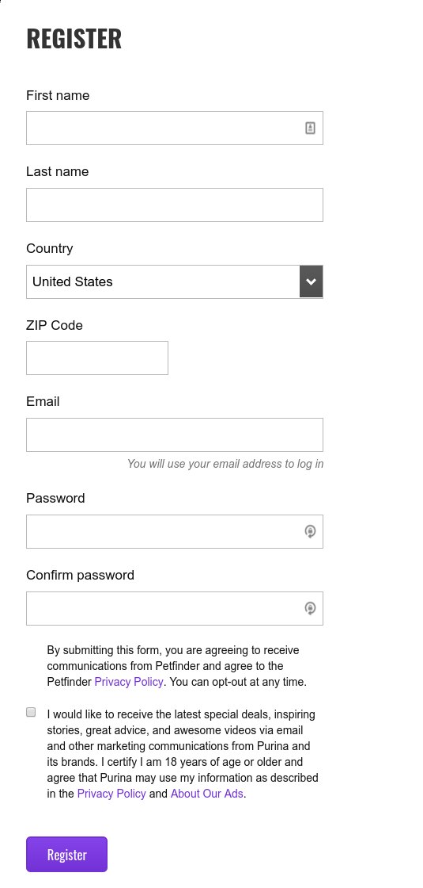
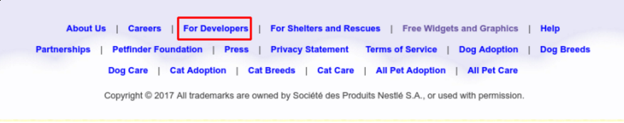
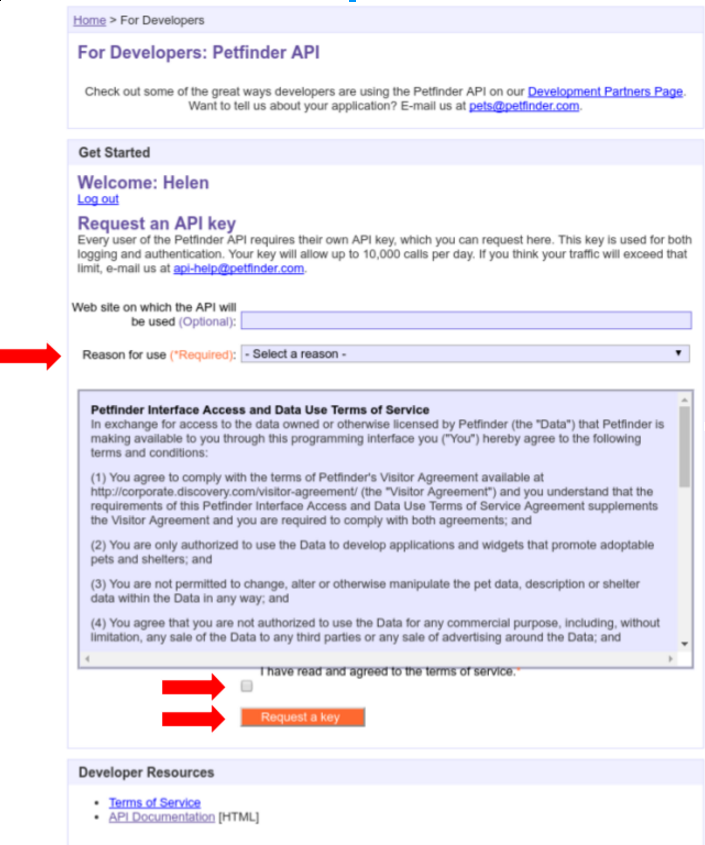
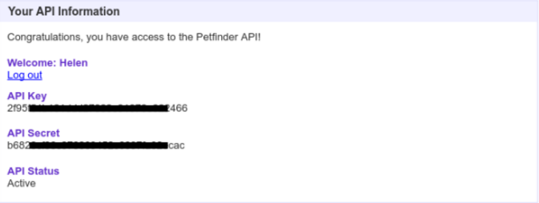
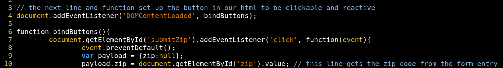

# Welcome
[Petfinder.com](www.petfinder.com) is an online database of adoptable pets. They work with over 14,000 shelters, and have helped the adoption of over 25 million animals. Petfinder offers an API to developers that want to connect to their database.

In this tutorial we’ll make use of the Petfinder API with HTML, Javascript, AJAX, and JSONP.  It’ll help if you have some knowledge of Javascript. 

### Here’s what we’ll cover:
* What’s an API?
* Getting a Key
* Our HTML
* Our Script
* JSONP
* Navigating the Response

### Final product
We will build a form that takes a zip code, calls the Petfinder API, and returns the name, image, and location of a nearby adoptable cat.

### References
[Petfinder API documentation](https://www.petfinder.com/developers/api-docs)
[JSONP](https://learn.jquery.com/ajax/working-with-jsonp/)

# What’s an API?

Let's say you have a cat. If you have a cat, you probably also have a blog about that cat. One day it occurs to you that all the people looking at pictures of your cat might like to have their own. You want to put a search bar in your blog where people can search for adoptable pets near them. Unfortunately, you don’t have the time or resources to build a database of all the adoptable pets in the world. You could link your users to petfinder.com, but then you’ll lose traffic. You want to keep readers engaged and on your site. Luckily for you- there are enough cat blogs on the internet that this is a solved problem, and that’s where APIs come in.

**API** stands for **Application Programming Interface**. APIs are provided by the developers of a piece of software. Using the API, other developers can query and receive data from that software, and integrate it into their own, separate software. Petfinder.com offers an API with built in methods that can find and return pet and shelter information from their database.
You can read about Petfinder’s API [here](https://www.petfinder.com/developers/api-docs). Their documentation is very straightforward and thorough, so this tutorial won’t spend too much time restating it. Instead I’ll talk briefly about getting set up with a developer key, and then go into detail on a specific method. The documentation lists the required arguments and response formats for every method, if you’re interested in learning more about those.  

# Getting a Key
When you send any query through the Petfinder API, they require one of your arguments to be a key.  I’ll explain exactly what these means later, but know that it is not unusual - most APIs ask for something called a developer key or API key. It’s a piece of information that identifies who you are and let’s them know you’ve asked for permission to use the API ahead of time. Think of it like a secret password to get into a club (except everyone at the club has their own unique password.) 

Getting a key from Petfinder is easy. The first thing you need to do is sign up for an account.  Go to the [home page](www.petfinder.com) and click ‘Sign In’ at the top right. Then, click the ‘Register Now’ button and fill in your information.


Pro tip: you can opt out of the checkbox at the bottom and still successfully register.

Once you’ve registered navigate to the developer information page, either by clicking [here](https://www.petfinder.com/developers/api-key), or scrolling to the bottom of the page and clicking ‘For Developers’. 


This will bring you right to the key request page, pictured below. Select the Reason for use from the dropdown, check the terms and service button, and hit the ‘Request a Key’ button. 


You’re done! Your API Key will be automatically generated, and you’ll be redirected to that page. You also get something called an API Secret. You would need this if you were going to use the API to request private information, like user data. Our tutorial is only using public data so I won’t go into it, but you can read more about it in the [documentation](https://www.petfinder.com/developers/api-docs) if you’re interested. 



Note- I’ve obscured my key and secret for security reasons. But it doesn’t take long to request your own!

Now that you have your key, you’re almost ready to send queries to the database.  But first, let’s talk about the HTML side of our project. 

# Our HTML
Recall that our goal is to create a search bar that takes a zip code and returns the name and image of a local, adoptable cat. To achieve this, we’ll need a form to take the zip code, and a button that will kick off our query to Petfinder. This doesn’t really have much to do with the API, so we won’t spend too much time on it. But there is one thing I’d like to highlight.

For reasons we’ll get into later, we’re going to need to use something called JSONP in our API call. JSONP can be tricky to work with, so we are add on something called JQuery. JQuery is a Javascript library that will let us write a JSONP call, which can be hard, in a similar way we would write any Ajax call, which is much easier. Below is the section of our html where we include our script  file, just before the closing body tag. We’ve added a source attribute to this tag. It links to the JQuery library we need, hosted by Google. This is how we ‘include’ the library so we can use its functionality in our code. 

```html
<script src="https://ajax.googleapis.com/ajax/libs/jquery/3.1.1/jquery.min.js"></script>
		<script src='script.js'></script>
	</body>
```

For more information on JQuery click [here](https://www.w3schools.com/jquery/jquery_intro.asp), and for more information on Google Hosted Libraries, click [here](https://developers.google.com/speed/libraries/#jquery).

# Our Script
### Setting Up the Button
The very first line of the script assigns our API to a variable. It’s a long, awkward string, so it will keep the code more readable to put it into a variable.
")

The next few lines of the script just deal with setting up our button. Remember, this call will hinge on the user entering a zipcode into a form and hitting the submit button


payload is the variable name we’re using to store the form return, and payload.zip will have the actual zipcode. This will come up later when we are filling out our query attributes.

### JSONP and Making the Call

### Navigating the Response
